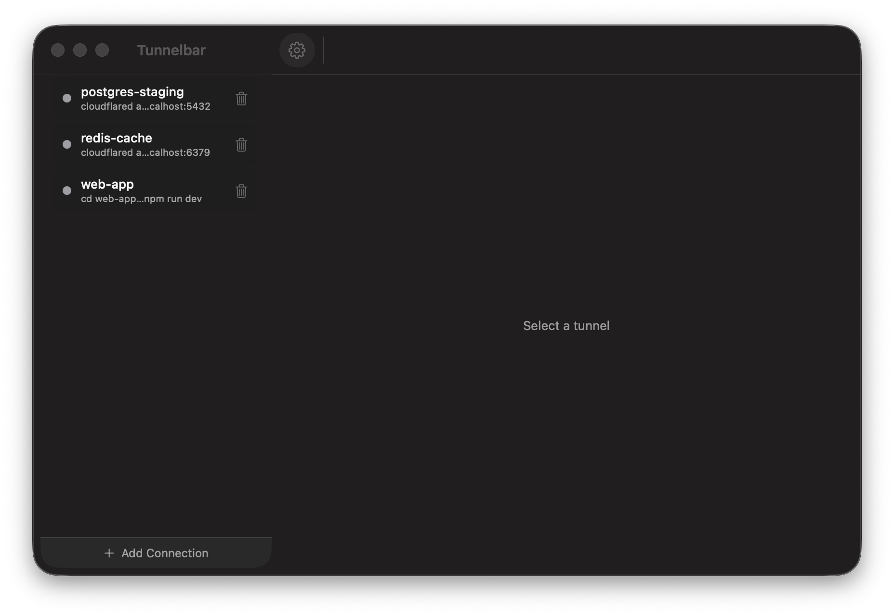

# Tunnelbar

A native macOS **menu-bar app** for managing your `cloudflared` tunnels — and
any other long-running command — through a simple UI, instead of juggling
terminal windows.

> Add a connection by pasting a command, start/stop it from the menu bar, and
> watch its live logs. Built in Swift, no Electron, ~1 MB.

[](https://github.com/ayush-sharaf/tunnelbar/actions/workflows/ci.yml)




## Features

- **Menu-bar icon** — every connection shows a live status dot (🟢 running /
  ⚪️ stopped / 🟡 transitioning / 🔴 failed). Start, stop, restart, view logs,
  or copy the command from a submenu. The icon shows a count of running ones.
- **Add by pasting any command** — e.g.
  `cloudflared access tcp --hostname tunnel-int.example.com/postgres --url localhost:2346`
  or `cd my-app && npm start`. Optionally set a working directory. Commands run
  through your login shell, so Homebrew/nvm tools resolve automatically.
- **Manager window** with a list of connections and a **live, streaming log
  view** per connection. **⌘-click** URLs or file paths in the logs to open
  them (like Terminal.app).
- **Manual control** — connections start/stop only when you tell them to.
- **Reorderable list** — drag connections to reorder; delete inline with the
  trash button or add via the strip at the bottom of the list.
- **Settings** — light / dark / system theme, open-at-login toggle, and version
  info (⌘, or the gear button).
- **Persistent** — connections are saved to
  `~/Library/Application Support/Tunnelbar/connections.json`; per-connection
  logs go to `…/Tunnelbar/logs/<id>.log`.

## Install

**Requirements:** macOS 14+ (Apple Silicon). Tunnelbar isn't notarized by Apple
(it's a free, open-source app), so each method below clears the Gatekeeper
quarantine for you. Full walkthrough, updating, and uninstall steps:
**[INSTALL.md](INSTALL.md)**.

### 1. One-line install (recommended)

```sh
curl -fsSL https://tunnelbar.vercel.app/install.sh | bash
```

Downloads the latest release, installs **Tunnelbar.app** to `/Applications`,
removes the quarantine flag, and launches it — no prompts. (Prefer not to pipe
to bash? Review [`website/install.sh`](website/install.sh) first.)

### 2. Download the DMG

Grab `Tunnelbar-x.y.dmg` from
[Releases](https://github.com/ayush-sharaf/tunnelbar/releases/latest), drag
**Tunnelbar** into **Applications**, then clear the quarantine flag once:

```sh
xattr -dr com.apple.quarantine /Applications/Tunnelbar.app
```

### 3. Build from source

Requires the Swift toolchain (Xcode **or** the Command Line Tools). Locally
built apps aren't quarantined.

```sh
git clone https://github.com/ayush-sharaf/tunnelbar.git
cd tunnelbar
./build.sh          # compiles and produces Tunnelbar.app
open Tunnelbar.app
./package.sh        # optional: DMG + zip in dist/
```

> The build uses `swiftc` directly (see `build.sh`) rather than `swift build`,
> because SwiftPM's manifest API is broken in bare Command Line Tools installs.
> With full Xcode, `swift build` also works.

### Updating

Re-run the one-line installer (it always fetches the latest), or download the
newer DMG. **Settings → Check for Updates** flags new versions in-app.

## Usage

1. Click the menu-bar icon → **Add Connection…** (or open the app to get the
   manager window).
2. Paste a command, optionally set a working directory and name.
3. Start/stop from the menu-bar submenu or the manager window.
4. **Show Logs…** to watch live output; ⌘-click links to open them.

## Requirements

- macOS 14 (Sonoma) or later, Apple Silicon.
- The CLI tools your commands use (`cloudflared`, `node`/`npm`, …) installed and
  on your `PATH`.

## Security & privacy

Your connection commands and their captured logs are stored **unencrypted** on
disk under `~/Library/Application Support/Tunnelbar/` (a per-user directory).
This is fine for typical tunnel/start commands, but **avoid putting secrets or
tokens directly in a command string** — prefer environment variables, a
keychain helper, or a credentials file referenced by the command, so the secret
isn't written to `connections.json` or the log files. Nothing leaves your
machine; Tunnelbar only spawns the commands you give it.

## Project layout

| File | Purpose |
|------|---------|
| `Sources/Tunnelbar/main.swift` | Entry point; starts as an accessory (menu-bar) app |
| `AppDelegate.swift` | Status-bar item, dynamic menu, manager window |
| `Models.swift` | `ConnectionConfig`, `TunnelStatus`, `LogLine` |
| `CommandParser.swift` | Tokenizes commands; suggests connection names |
| `Tunnel.swift` | Spawns/monitors the process, captures logs |
| `TunnelStore.swift` | Connection list & persistence |
| `Views.swift` | SwiftUI manager window, detail, logs, add/edit editor |

## Contributing

Issues and PRs welcome — see [CONTRIBUTING.md](CONTRIBUTING.md). Keep changes
focused and match the surrounding code style. There are no external
dependencies — just Swift + AppKit/SwiftUI. `main` is protected; CI
(`build-and-test`) must pass before merging.

## License

[MIT](LICENSE) © 2026 Ayush Sharaf
